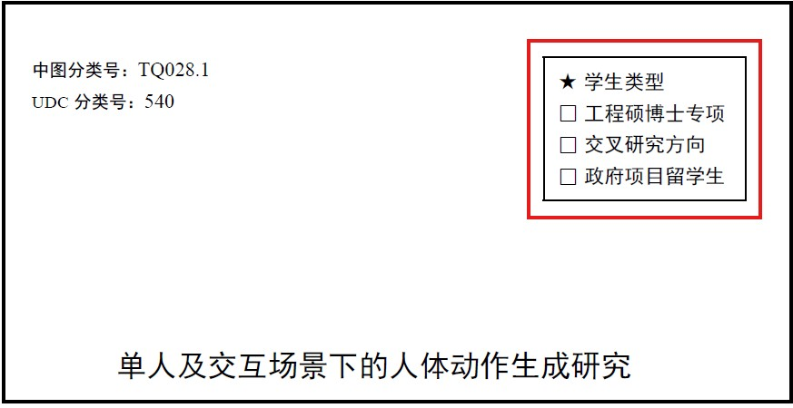
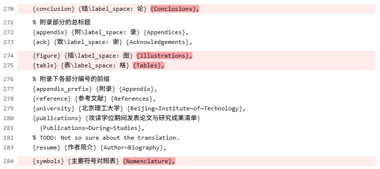

# BIT-Thesis-2025-MAY
The latest latex template for BIT-Thesis submission (Masters and PhD) (MAY 2025). This is the fork of "https://bithesis.bitnp.net" with some adjustments.

## Setup the environment
1. Download TexLive
```
https://eu.mirrors.cicku.me/ctan/systems/texlive/Images/texlive2025.iso
```
3. Install TexLive by running install-tl-windows.exe
4. Confirm installation
5. Open PowerShell for Windows and run following commands one-by-one

```PowerShell
latexmk --version
xelatex --version
biber --version

tlmgr update --self
tlmgr install bithesis
tlmgr update bithesis
```
4. Download and Install TeXstudio
   https://www.texstudio.org/
5. Settings > Time & Language > Language & Region > Add a Language > Install Chinese (Simplified, China)
6. Download this repository Code > Download Zip
7. Extract the downloaded archieve
8. Open thesis.tex and Run


> [!NOTE]
> For Blind Review submission, set the flag blindPeerReview=true in the documentclass tag with in main.tex file. 
```latex
\documentclass[type=doctor,twoside=false, english=true, blindPeerReview=true]{bithesis}
```

# IMPORTANT (Further changes to make)

#### 1. To add special type box in cover pages, add the below line of code in main.tex file.



#### 2. Add page break in between originallity and authorization page by making following changes in bithesis.cls file.


#### 3. Correct titles for list fo figures and tables in bithesis.cls file.



#### 4. Correct citation style for 2 successive referencesin gb7714-2015.cbx file.

Workaround suggested by Tekie Tsegay Tewolde.

Two concecussive citations should appear as  [1,2] but in the original template they appear as [1-2].

* Go the the following directory:
```
C:\texlive\2025\texmf-dist\tex\latex\biblatex-gb7714-2015\
```
* Open the file gb7714-2015.cbx in any editor. 
* Do the following modifications.


